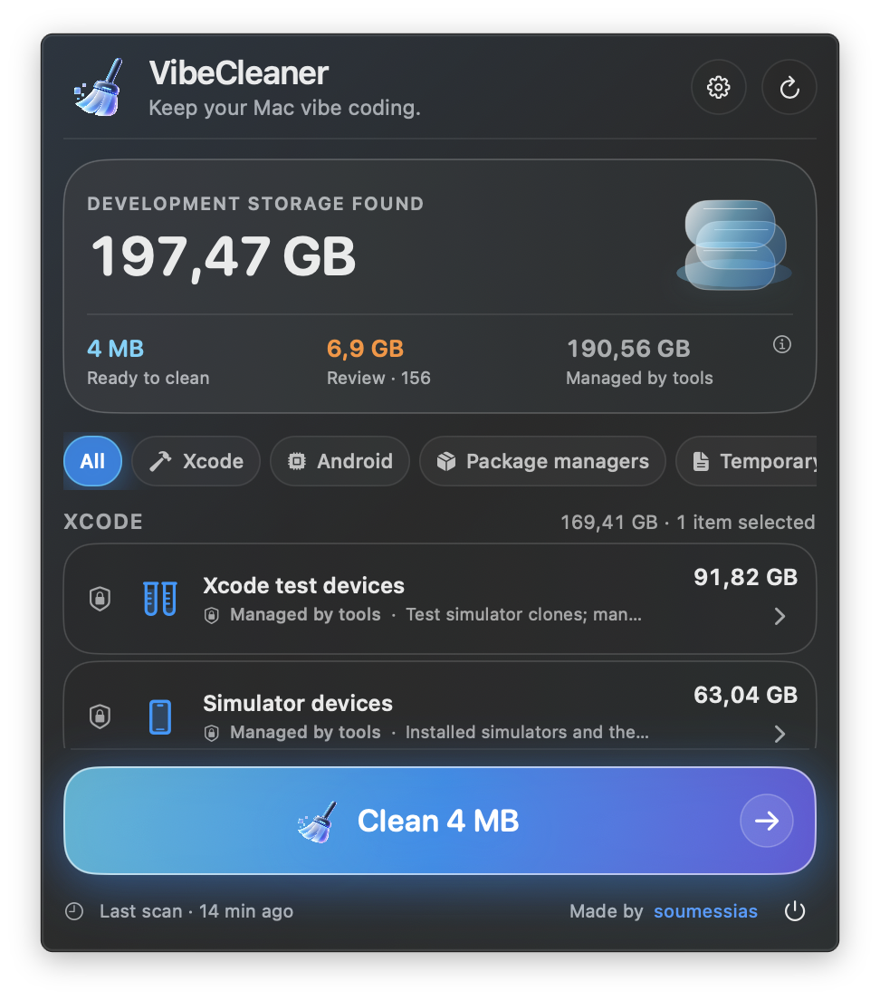
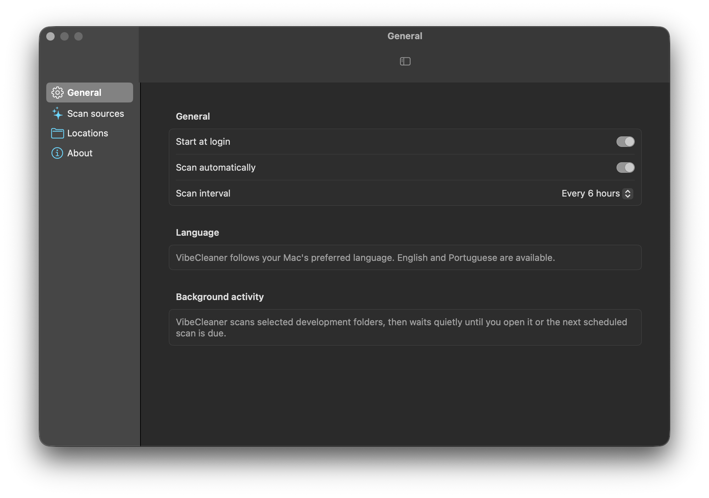

<p align="center">
  
</p>

<h1 align="center">VibeCleaner</h1>

<p align="center">
  <strong>Mais espaço para criar. Menos resíduos de build.</strong><br>
  A lightweight macOS menu bar app for developer disk cleanup.
</p>

<p align="center">
  macOS 13+ · SwiftUI · Português / English · <a href="LICENSE">Apache License 2.0</a>
</p>

<p align="center">
  <a href="#português">Português</a> · <a href="#english">English</a>
</p>

VibeCleaner mostra quanto espaço caches e arquivos temporários de desenvolvimento ocupam, separa o que pode ser limpo do que exige revisão e ajuda você a manter o Mac pronto para a próxima ideia. Feito por [soumessias](https://soumessias.com).

## Capturas de tela · Screenshots

Capturas reais da versão atual no macOS. Os valores mudam conforme os arquivos de cada Mac. / Real captures of the current macOS app; amounts vary by machine.

| Barra de menus / Menu bar | Ajustes / Settings |
| :---: | :---: |
| [](docs/screenshots/menu-bar.png) | [](docs/screenshots/settings.png) |

> **Estado do projeto:** versão inicial disponível para compilar a partir do código. Ainda não há instalador público assinado com Developer ID nem app notarizado.

## Português

### O que o app faz

- Fica na barra de menus, sem janela permanente ou serviço pesado em segundo plano.
- Mede locais conhecidos de Xcode, Android/Gradle, gerenciadores de pacotes, Swift e Dart, além de algumas pastas temporárias de build.
- Mostra cada caminho e tamanho, com filtros por categoria e uma confirmação antes da limpeza.
- Permite selecionar ou desmarcar todos os itens da lista de revisão e acompanha a limpeza com progresso e resultado visíveis.
- Permite ativar ou desativar fontes de análise, adicionar pastas específicas para revisão e excluir caminhos da análise e da limpeza.
- Segue o idioma do macOS, com interface em português e inglês. Pode iniciar com o login e analisar automaticamente em intervalos configuráveis.

### Entenda os números

| Grupo | O que significa | Limpeza pelo VibeCleaner |
| --- | --- | --- |
| **Pronto para limpar** | Caches conhecidos e recriáveis, como Derived Data do Xcode e cache do Gradle. | Selecionados por padrão; você pode desmarcar. |
| **Revisar** | Builds temporários, alguns stores de pacotes e pastas adicionadas por você. | Desmarcados por padrão; confira o caminho antes de selecionar. |
| **Gerenciado pelas ferramentas** | Simuladores, dispositivos de teste, archives, suporte de dispositivos e SDK Android. | Somente consulta; o app não seleciona nem apaga. |

O total de **armazenamento de desenvolvimento encontrado** soma os três grupos. Ele **não** é a promessa de espaço que o botão Limpar vai liberar. O valor do botão corresponde apenas aos itens selecionados para limpeza. O número na barra de menus representa o espaço **pronto para limpar**. Tamanhos de `~/Library/Developer`, `~/Library/Android` ou `/private/tmp` medidos por outras ferramentas podem incluir dados que ficam fora do catálogo do VibeCleaner.

### Começar

**Requisitos:** macOS 13 ou posterior, Xcode com Swift 5.9 ou posterior e ferramentas de linha de comando selecionadas. O projeto não usa pacotes de terceiros.

Clone ou baixe este repositório. Na pasta do projeto, execute:

```sh
./Scripts/build-app.sh
open dist/VibeCleaner.app
```

O script cria um app universal para Macs com Apple silicon e Intel em `dist/`. A assinatura feita durante a compilação é **ad hoc**, apenas para executar localmente; ela não substitui assinatura com Developer ID e notarização para distribuição. Abra a vassourinha na barra de menus para analisar, revisar e limpar. Em **Ajustes**, você pode ativar **Iniciar com o login**, escolher o intervalo de análise e configurar fontes e exclusões. Para fechar o app, use o botão de sair no rodapé do menu.

### Cuidados antes de limpar

O VibeCleaner não usa `sudo`. Ele valida novamente os caminhos antes de apagar, respeita exclusões e pede confirmação com a lista de itens selecionados. Pastas temporárias e personalizadas podem conter arquivos importantes: confira o caminho e o conteúdo antes de marcá-las. Feche builds e ferramentas que estejam usando esses arquivos. Após a limpeza, alguns caches terão de ser baixados ou gerados novamente.

Archives, simuladores, dispositivos de teste e SDKs aparecem para você entender onde está o espaço, mas continuam sob o controle do Xcode ou Android Studio. O app também não faz uma limpeza genérica de `~/Library`, `/private/tmp` ou documentos pessoais.

### Contribuir e licença

Issues e pull requests são bem-vindos. Ao sugerir uma nova regra de limpeza, explique o caminho, o que há nele, como os arquivos podem ser recriados e por que a regra deve ser automática ou exigir revisão. Mantenha textos visíveis ao usuário localizados em inglês e português.

O projeto usa a **Apache License 2.0**. Consulte o texto integral em [`LICENSE`](LICENSE) para as permissões e condições de uso, modificação e redistribuição. Veja também a [direção de design](DESIGN.md) e a [tela conceitual](docs/design/vibecleaner-concept.png), que é uma referência visual e não uma captura da versão atual.

---

## English

**More room to create. Less build clutter.**

VibeCleaner is a lightweight native macOS menu bar app. It measures developer caches and temporary build files, separates ready-to-clean items from those needing review, and helps keep your Mac ready for the next idea.

### What it does

- Lives in the menu bar without a permanent window or heavy background service.
- Measures known Xcode, Android/Gradle, package manager, Swift and Dart locations, plus selected temporary build folders.
- Shows each path and size, category filters, and a confirmation step before cleanup.
- Lets you select or deselect the review queue at once and keeps cleanup progress and results visible.
- Lets you enable or disable scan sources, add specific folders for review, and exclude paths from scanning and cleanup.
- Follows the macOS language, with English and Portuguese available. It can start at login and scan automatically at a configurable interval.

### Understand the numbers

| Group | Meaning | Cleanup in VibeCleaner |
| --- | --- | --- |
| **Ready to clean** | Known regenerable caches, such as Xcode Derived Data and Gradle cache. | Selected by default; you can deselect them. |
| **Review** | Temporary builds, some package stores, and folders you add. | Deselected by default; inspect each path before selecting it. |
| **Managed by tools** | Simulators, test devices, archives, device support, and the Android SDK. | View only; the app never selects or deletes them. |

The **development storage found** total includes all three groups. It is **not** the amount the Clean button will recover. The button shows only the selected cleanup items. The menu bar value shows **ready-to-clean** space. Totals for `~/Library/Developer`, `~/Library/Android`, or `/private/tmp` from other tools may contain data outside VibeCleaner's focused catalog.

### Build and run

**Requirements:** macOS 13 or later, Xcode with Swift 5.9 or later, and selected command-line tools. No third-party packages are required.

Clone or download this repository. From the project root, run:

```sh
./Scripts/build-app.sh
open dist/VibeCleaner.app
```

The script builds a universal app for Apple silicon and Intel Macs in `dist/`. It applies an **ad hoc** signature for local use; the app is not Developer ID signed or notarized for public distribution. Open the broom in the menu bar to scan, review, and clean. In **Settings**, you can enable **Start at login**, adjust the scan interval, and configure sources and exclusions. Use the quit button at the bottom of the menu to close the app.

### Before cleaning

VibeCleaner does not use `sudo`. It validates paths again before deletion, respects exclusions, and asks for confirmation with the selected item list. Temporary and custom folders may contain valuable files: inspect their paths and contents before selecting them. Close builds and tools that may be using those files. Some caches will need to be downloaded or generated again afterward.

Archives, simulators, test devices, and SDKs are shown so you can understand their size, while Xcode or Android Studio remains responsible for managing them. The app does not sweep all of `~/Library`, `/private/tmp`, or personal documents.

### Contributing and license

Issues and pull requests are welcome. When proposing a new cleanup rule, describe its path, contents, how the files can be recreated, and why it should be automatic or require review. Keep user-facing copy localized in English and Portuguese.

VibeCleaner is released under the **Apache License 2.0**. See the full [`LICENSE`](LICENSE) for the permissions and conditions of use, modification, and redistribution. You can also read the [design direction](DESIGN.md) and view the [concept screen](docs/design/vibecleaner-concept.png), which is a visual reference rather than a screenshot of the current app.

Made by [soumessias](https://soumessias.com).
